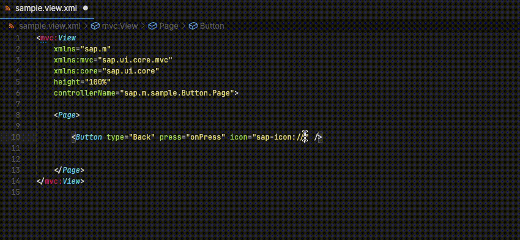

# UI5 Icons Symbols

⚠️ **IMPORTANT:** This extension requires the **SAP Icon Font** to be installed on your machine for proper functionality. You can download and install the font from the official SAP GitHub repository:

[Download SAP Icon Font](https://www.sap.com/design-system/fiori-design-web/resources/downloads#sap-icon-font)

This Visual Studio Code extension enhances your development workflow by displaying SAP UI5 icons next to their URI references in HTML, XML, JavaScript, and TypeScript files.

## Features

- Automatically detects SAP UI5 icon URIs (`sap-icon://...`) in your files and visually displays the corresponding icon.
- Supports `html`, `xml`, `javascript`, and `typescript` files.

Example of how the icons are displayed:



## Requirements

**SAP Icon Font** must be installed for the icons to display correctly. [Download and install the font here](https://www.sap.com/design-system/fiori-design-web/resources/downloads#sap-icon-font).

### How to install SAP Icon Font

#### macOS

Run the following command in the terminal:

```bash
FONT_DEST=~/Library/Fonts/SAP-icons.ttf
DOWNLOAD_URL="https://raw.githubusercontent.com/SAP/theming-base-content/master/content/Base/baseLib/baseTheme/fonts/SAP-icons.ttf"

echo "Checking SAP-icons font installation..."

mkdir -p ~/Library/Fonts && \
curl -L -o "$FONT_DEST" "$DOWNLOAD_URL" && \
echo "SAP-icons.ttf successfully installed or updated in ~/Library/Fonts/"
```

#### 🪟 Windows

You can install the font in two ways:

---

#### 🔧 **Option 1: Manual installation (no admin rights)**

This script downloads the font to your Downloads folder and opens the installation window. You will need to click **"Install"** manually.

```powershell
$fontName = "SAP-icons.ttf"
$downloadUrl = "https://raw.githubusercontent.com/SAP/theming-base-content/master/content/Base/baseLib/baseTheme/fonts/SAP-icons.ttf"
$downloadFolder = [Environment]::GetFolderPath("UserProfile") + "\Downloads"
$fontPath = Join-Path $downloadFolder $fontName

Write-Host "`nDownloading SAP Icons font..."
Invoke-WebRequest -Uri $downloadUrl -OutFile $fontPath

Start-Process $fontPath
Write-Host "`nInstallation window will open. Click 'Install'."
```

---

#### 🛡️ **Option 2: System-level installation (admin rights required)**

This script installs the font directly to `C:\Windows\Fonts` and registers it in the system registry without user interaction. **Run as Administrator.**

```powershell
$fontName = "SAP-icons.ttf"
$downloadUrl = "https://raw.githubusercontent.com/SAP/theming-base-content/master/content/Base/baseLib/baseTheme/fonts/SAP-icons.ttf"
$systemFontsPath = "$env:SystemRoot\Fonts"
$fontDestPath = Join-Path $systemFontsPath $fontName
$fontRegName = "SAP Icons"

Invoke-WebRequest -Uri $downloadUrl -OutFile $fontDestPath

New-ItemProperty -Path "HKLM:\SOFTWARE\Microsoft\Windows NT\CurrentVersion\Fonts" `
                 -Name "$fontRegName (TrueType)" `
                 -PropertyType String `
                 -Value $fontName `
                 -Force | Out-Null

Write-Host "Font successfully installed!"
```

## Extension Settings

This extension doesn't add any VS Code settings at the moment.

## Known Issues

There are currently no known issues. If you encounter any, please report them.

## Release Notes

### 1.0.0

- Initial release of UI5 Icons Symbols.
- Added support for detecting and displaying icons in HTML, XML, JavaScript, and TypeScript files.

### 1.0.1 - 5

- Bug fixes.

### 1.0.6 - 7

- Updated icon font version to SAP-icons Horizon 5.10.
- Added cross-platform installation scripts (macOS and Windows).
- Added support for automatic font installation on Windows with PowerShell (including system-level registration).
- Improved documentation clarity and user guidance for font setup.

### 1.0.8

- Added SVG generation for all available icons.
- Improved icon auto-completion suggestions with real-time visual previews.
- Optimized icon rendering performance in larger files.
- Enhanced overall UI responsiveness.

### 1.0.9

- Fixed font download scripts: SAP moved the icon font away from `experience.sap.com`. Scripts now download directly from the official SAP GitHub repository (`SAP/theming-base-content`), no ZIP extraction needed.
- Updated manual download link to the new SAP Design System page.

---

## For more information

For more details about how to create extensions for Visual Studio Code or how to contribute to this extension, check the following:

- [Visual Studio Code API](https://code.visualstudio.com/api)
- [Visual Studio Code Extension Guidelines](https://code.visualstudio.com/api/references/extension-guidelines)

**Enjoy using UI5 Icons Symbols!**
