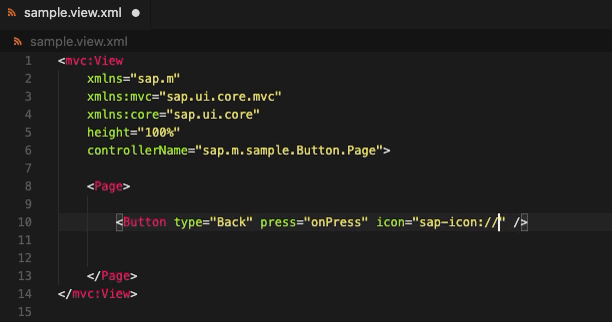

# UI5 Icons Symbols

⚠️ **IMPORTANT:** This extension requires the **SAP Icon Font** to be installed on your machine for proper functionality. You can download and install the font from the following link:

[Download SAP Icon Font](https://experience.sap.com/fiori-design-web/downloads/#sap-icon-font)

This Visual Studio Code extension enhances your development workflow by displaying SAP UI5 icons next to their URI references in HTML, XML, JavaScript, and TypeScript files.

## Features

- Automatically detects SAP UI5 icon URIs (`sap-icon://...`) in your files and visually displays the corresponding icon.
- Supports `html`, `xml`, `javascript`, and `typescript` files.
  
Example of how the icons are displayed:

## Requirements

**SAP Icon Font** must be installed for the icons to display correctly. [Download and install the font here](https://experience.sap.com/fiori-design-web/downloads/#sap-icon-font).

## Extension Settings

This extension doesn't add any VS Code settings at the moment.

## Known Issues

There are currently no known issues. If you encounter any, please report them.

## Release Notes

### 1.0.0

- Initial release of UI5 Icons Symbols.
- Added support for detecting and displaying icons in HTML, XML, JavaScript, and TypeScript files.

---

## For more information

For more details about how to create extensions for Visual Studio Code or how to contribute to this extension, check the following:

- [Visual Studio Code API](https://code.visualstudio.com/api)
- [Visual Studio Code Extension Guidelines](https://code.visualstudio.com/api/references/extension-guidelines)

**Enjoy using UI5 Icons Symbols!**
